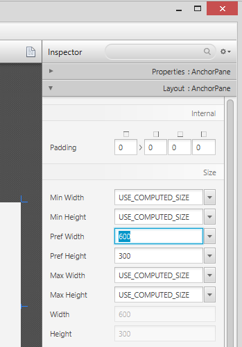
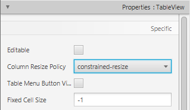
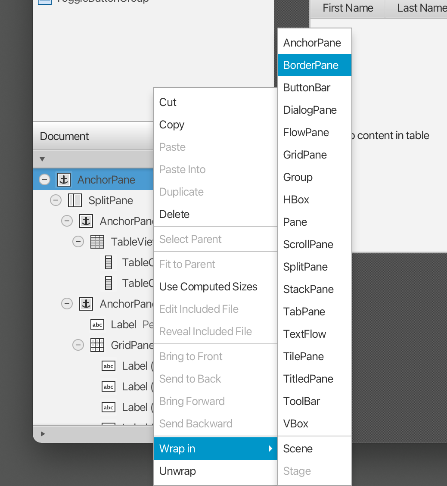
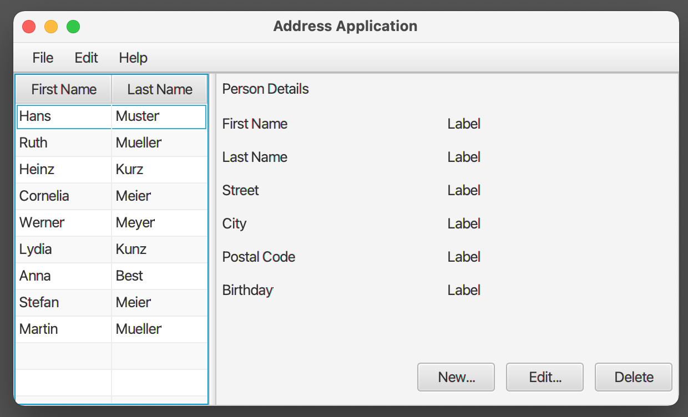
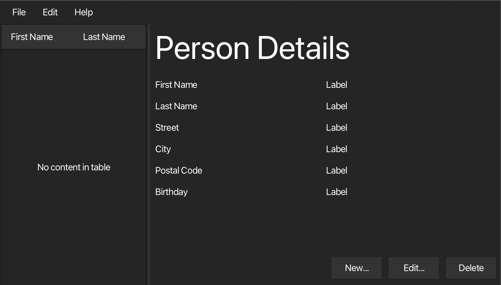
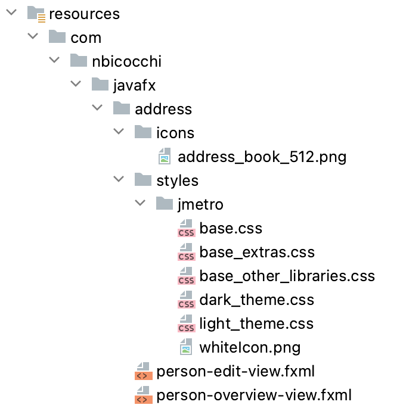

# JavaFX Tutorial

Reference application: [address-book](../code/desktop-address-book)

## Scene Builder

### Create a new JavaFX Project
In IntelliJ go to *File | New | Project...* and choose *JavaFX*. Specify the Name of the project (e.g. *AddressApp*), select *Java*, and *Maven*.

Remove the *application* package and its content if it was automatically created.

### Create the FXML Layout File
There are two ways to create the user interface. Either using an XML file or programming everything in Java. Looking around the internet you will encounter both. We will use XML (ending in .fxml) for most parts. I find it a cleaner way to keep the controller and view separated from each other. Further, we can use the graphical Scene Builder to edit our XML. That means we will not have to directly work with XML.

Create inside *resources* a directory hierarchy **specular to the one of our application** (e.g., com.nbicocchi.javafx.addressbook). Right-click on the package and create a new *FXML File* called `person-overview-view.fxml`.

### Design with Scene Builder
Right-click on `person-overview-view.fxml` and choose *Open in Scene Builder*. Now you should see *Scene Builder* with just an *AnchorPane* (visible under Hierarchy on the left).

(If *Scene Builder* does not open, go to *Preferences | Languages and Frameworks | JavaFX* and set the correct path to your *Scene Builder* installation).

1. Select the *Anchor Pane* in your Hierarchy and adjust the size under Layout (right side):   


2. Add a *Split Pane (Horizontal Flow)* by dragging it from the Library into the main area. Right-click the *Split Pane* in the *Hierarchy* view and select *Fit to Parent*.   


3. Drag a *TableView* (under *Controls*) into the left side of the *SplitPane*. Right-click the *TableView* in the *Hierarchy* view and select *Fit to Parent*.

4. Go to the menu *Preview | Show Preview in Window* to see, whether it behaves right. Try resizing the window. The TableView should resize together with the window as it is anchored to the borders.

5. Change the column text (under Properties) to "First Name" and "Last Name".   


6. Select the *TableView* and choose *constrained-resize* for the *Column Resize Policy* (under Properties). This ensures that the columns will always take up all available space.   


7. Add a *Label* on the right side with the text "Person Details" (hint: use the search to find the *Label*). Adjust its layout using anchors.   


8. Add a *GridPane* on the right side, select it and adjust its layout using anchors (top, right and left).    


9. Add the following labels to the cells.   
*Note: To add a row to the GridPane select an existing row number (will turn yellow), right-click the row number and choose "Add Row".*   


10. Add a *ButtonBar* at the bottom. Add three buttons to the bar. Now, set anchors (right and bottom) to the *ButtonBar*, so it stays in the right place.   


11. Wrap the *AnchorPane* in a *BorderPane*


12. Add a *MenuBar* into the TOP Slot of the *BorderPane*. We will not implement the menu functionality at the moment.   


13. Now you should see something like the following. Use the *Preview* menu to test its resizing behaviour.   


### The JavaFX Main Class
Now, we need to create the **main java class** that starts up our application with the `person-overview-view.fxml` view.

Create an *AddressApplication* class containing the following code:

```
public class AddressApplication extends Application {
    public static void main(String[] args) {
        launch(args);
    }

    @Override
    public void start(Stage stage) throws Exception {
        Parent root = FXMLLoader.load(getClass().getResource("person-overview-view.fxml"));
        Scene scene = new Scene(root);
        stage.setTitle("Address Application");
        stage.setScene(scene);
        stage.show();
    }
}
```

The class extends `Application` and contains two methods. This is the basic structure that we need to start a JavaFX Application. The most important part for us is the `start(Stage primaryStage)` method. It is automatically called when the application is `launched` from the `main` method. As you see, the `start(...)` method receives a `Stage` as parameter. The following graphic illustrates the structure of every JavaFX application:

   

The `Stage` is the main container which is usually a `Window` with a border and the typical minimize, maximize and close buttons. Inside the `Stage` you add a `Scene` which can, of course, be switched out by another `Scene`. Inside the `Scene` the actual JavaFX nodes like `AnchorPane`, `TextBox`, etc. are added.

### module-info.java
Java 9 modularity adds a higher level of aggregation above packages. The key new language element is the **module** a uniquely named, reusable group of related packages, as well as resources (such as images and XML files) and a module descriptor specifying:
* the module’s name
* the module’s dependencies (that is, other modules this module depends on)
* the packages it explicitly makes available to other modules (all other packages in the module are implicitly unavailable to other modules)
* the services it offers
* the services it consumes
* to what other modules it allows reflection

The key goals of modularizing the Java SE platform are:

* Reliable configuration: Modularity provides mechanisms for explicitly declaring dependencies between modules in a manner that’s recognized both at compile time and execution time. The system can walk through these dependencies to determine the subset of all modules required to support your app. 
* Strong encapsulation: The packages in a module are accessible to other modules only if the module explicitly exports them. Even then, another module cannot use those packages unless it explicitly states that it requires the other module’s capabilities. This improves platform security because fewer classes are accessible to potential attackers. 
* Scalable Java platform: Previously, the Java platform was a monolith consisting of a massive number of packages, making it challenging to develop, maintain and evolve. It couldn’t be easily subsetted. The platform is now modularized into 100+ modules (this number might change as Java evolves). 
* Greater platform integrity: Before Java 9, it was possible to use many classes in the platform that were not meant for use by an app’s classes. With strong encapsulation, these internal APIs are truly encapsulated and hidden from apps using the platform. 
* Improved performance: The JVM uses various optimization techniques to improve application performance. 

For the sake of our project, update _module-info.java_ as follows (replacing _com.nbicocchi.javafx.addressbook_ with your own package name):

```
open module com.nbicocchi.javafx.addressbook {
    requires java.desktop;
    requires java.sql;
    requires javafx.controls;
    requires javafx.fxml;
}
```


## Model and TableView

### Create the Model Class
We need a model class to hold information about the people in our address book. 

The `Person` class will have a few instance variables for the name, address and birthday. Add the following code to the class. I'll explain some JavaFX specifics after the code.


### Person.java
```java
import java.time.LocalDate;

public class Person {
    private String firstName;
    private String lastName;
    private String street;
    private Integer postalCode;
    private String city;
    private LocalDate birthday;

    public Person() {

    }

    public Person(String firstName, String lastName, String street, Integer postalCode, String city, LocalDate birthDay) {
        this.firstName = firstName;
        this.lastName = lastName;
        this.street = street;
        this.postalCode = postalCode;
        this.city = city;
        this.birthday = birthDay;
    }

    public Person(Person other) {
        this.firstName = other.getFirstName();
        this.lastName = other.getLastName();
        this.street = other.getStreet();
        this.postalCode = other.getPostalCode();
        this.city = other.getCity();
        this.birthday = other.getBirthday();
    }

    public String getFirstName() {
        return firstName;
    }

    public void setFirstName(String firstName) {
        this.firstName = firstName;
    }

    public String getLastName() {
        return lastName;
    }

    public void setLastName(String lastName) {
        this.lastName = lastName;
    }

    public String getStreet() {
        return street;
    }

    public void setStreet(String street) {
        this.street = street;
    }

    public Integer getPostalCode() {
        return postalCode;
    }

    public void setPostalCode(Integer postalCode) {
        this.postalCode = postalCode;
    }

    public String getCity() {
        return city;
    }

    public void setCity(String city) {
        this.city = city;
    }

    public LocalDate getBirthday() {
        return birthday;
    }

    public void setBirthday(LocalDate birthday) {
        this.birthday = birthday;
    }
}
```

### The PersonOverviewController
Now let's finally get some data into our table. We'll need a controller for our `person-overview-view.fxml`.

1. Create a class named `PersonOverviewController.java`. 
2. We'll add some instance variables that give us access to the table and the labels inside the view. The fields and some methods have a special `@FXML` annotation. This is necessary for the fxml file to have access to private fields and private methods. After we have everything set up in the fxml file, the application will automatically fill the variables when the fxml file is loaded. So let's add the following code:

Remember to always use the **javafx imports**, NOT awt or swing!

```java
import javafx.collections.FXCollections;
import javafx.collections.ObservableList;
import javafx.fxml.FXML;
import javafx.scene.control.Label;
import javafx.scene.control.TableColumn;
import javafx.scene.control.TableView;
import javafx.scene.control.cell.PropertyValueFactory;

public class PersonOverviewController {
    @FXML private TableView<Person> personTable;
    @FXML private TableColumn<Person, String> firstNameColumn;
    @FXML private TableColumn<Person, String> lastNameColumn;

    @FXML private Label firstNameLabel;
    @FXML private Label lastNameLabel;
    @FXML private Label streetLabel;
    @FXML private Label cityLabel;
    @FXML private Label postalCodeLabel;
    @FXML private Label birthdayLabel;

    /**
     * Initializes the controller class. This method is automatically called after the fxml file has been loaded.
     */
    @FXML
    public void initialize() {
        // Initialize the person table with the two columns.
        firstNameColumn.setCellValueFactory(new PropertyValueFactory<>("firstName"));
        lastNameColumn.setCellValueFactory(new PropertyValueFactory<>("lastName"));
        personTable.setItems(getPersonData());
    }
    
    ObservableList<Person> getPersonData() {
        ObservableList<Person> persons = FXCollections.observableArrayList();
        persons.add(new Person("Hans", "Muster", "Schillerstraße", 1123, "Munich", LocalDate.of(1955, 1, 3)));
        persons.add(new Person("Ruth", "Mueller", "Goethestraße", 5437, "Berlin", LocalDate.of(1934, 2, 23)));
        persons.add(new Person("Heinz", "Kurz", "Jahnstraße", 6778, "Leipzig", LocalDate.of(1929, 2, 13)));
        persons.add(new Person("Cornelia", "Meier", "Mozartstraße", 2234, "Nuremberg", LocalDate.of(1977, 6, 5)));
        persons.add(new Person("Werner", "Meyer", "Hauptstraße", 8879, "Frankfurt", LocalDate.of(1976, 6, 6)));
        persons.add(new Person("Lydia", "Kunz", "Hauptstraße", 9823, "Frankfurt", LocalDate.of(1999, 6, 16)));
        persons.add(new Person("Anna", "Best", "Schulstraße", 5872, "Erfurt", LocalDate.of(1984, 8, 2)));
        persons.add(new Person("Stefan", "Meier", "Gartenstraße", 3386, "Bremen", LocalDate.of(1987, 10, 21)));
        persons.add(new Person("Martin", "Mueller", "Bahnhofstraße", 3345, "Hamburg", LocalDate.of(1992, 10, 7)));
        return persons;
    }
}
```


Now this code will probably need some explaining:

* All fields and methods where the fxml file needs access must be annotated with `@FXML`. Actually, only if they are private, but it's better to have them private and mark them with the annotation!
* The `initialize()` method is automatically called after the fxml file has been loaded. At this time, all the FXML fields should have been initialized already.
* The `setCellValueFactory(...)` that we set on the table columns are used to determine which field inside the `Person` objects should be used for the particular column.
* We are working with JavaFX view classes that need to be informed about any changes made to the list of persons. This is important, since otherwise the view would not be in sync with the data. For this purpose, JavaFX introduces some new [Collection classes](http://docs.oracle.com/javase/8/javafx/javafx-collections-tutorial/collections.htm). From those collections, we need the `ObservableList`.

### Properties
With JavaFX, it's common to use [`Properties`](http://docs.oracle.com/javase/8/javafx/javafx-api/javafx/javafx-beans/property/Property.html) for all fields of a model class. A `Property` allows us, for example, to automatically be notified when the `lastName` or any other variable is changed. This helps us keep the view in sync with the data. To learn more about `Properties` read [Using JavaFX Properties and Binding](http://docs.oracle.com/javase/8/javafx/javafx-properties-binding-tutorial/binding.htm).

### Hook the View to the Controller
We're almost there! But one little thing is missing: We haven't told our `person-overview-view.fxml` file yet, which controller to use and which element should match to which field inside the controller.

1. Open `person-overview-view.fxml` with *Scene Builder*.

2. Open the *Controller* group on the left side and select the `PersonOverviewController` as **controller class**. Use the fully qualified name of the Controller. In the example below it is: `com.nbicocchi.javafx.address.PersonOverviewController`   


3. Select the `TableView` in the *Hierarchy* group and choose in the *Code* group the `personTable` field as **fx:id**.   


4. Do the same for the columns and select `firstNameColumn` and `lastNameColumn` as **fx:id** respectively.

5. For **each label** in the second column, choose the corresponding **fx:id**.   


**To successfully run the application it is important that:** 
* all reference names annotated with @FXML in your controller (e.g., personTable, firstNameColumn, lastNameColumn, etc.) are assigned to the corresponding graphical component in SceneBuilder.
* all .fxml views are located inside a directory hierarchy which is **identical** to the one of their corresponding FXMLLoaders. For example, if your _main()_ method which loads `person-overview-view.fxml` is located in `com.nbicocchi.javafx.address`, the fxml file has to be located in the same location (but inside the resources folder).

### Start the Application
When you start your application now, you should see something like this:




## Interacting with the user

### React to Table Selections
We haven't used the right side of our application, yet. The idea is to display the details about a person on the right side when the user selects a person in the table.

First, let's add a new method inside `PersonOverviewController` that helps us fill the labels with the data from a single `Person`.

Create a method called `showPersonDetails(Person person)`. Go through all the labels and set the text using `setText(...)` with details from the person. If `null` is passed as parameter, all labels should be cleared.

```java
/**
 * Fills all text fields to show details about the person.
 * If the specified person is null, all text fields are cleared.
 *
 * @param person the person or null
 */
private void showPersonDetails(Person person) {
    if (person != null) {
        firstNameLabel.setText(person.getFirstName());
        lastNameLabel.setText(person.getLastName());
        streetLabel.setText(person.getStreet());
        postalCodeLabel.setText(Integer.toString(person.getPostalCode()));
        cityLabel.setText(person.getCity());
        birthdayLabel.setText(person.getBirthday().toString());
    } else {
        firstNameLabel.setText("");
        lastNameLabel.setText("");
        streetLabel.setText("");
        postalCodeLabel.setText("");
        cityLabel.setText("");
        birthdayLabel.setText("");
    }
}
```


### Listen for Table Selection Changes
To get informed when the user selects a person in the person table, we need to *listen for changes*.

There is an interface in JavaFX called [`ChangeListener`](http://docs.oracle.com/javase/8/javafx/api/) with one method called `changed(...)`. The method has three parameters: `observable`, `oldValue`, and `newValue`.

We will create such a `ChangeListener` using a Java 8 *lambda expression*. Let's add a few lines to the `initialize()` method in `AddressController`. Now it looks like this:

```java
@FXML
public void initialize() {
    // Initialize the person table with the two columns.
    firstNameColumn.setCellValueFactory(new PropertyValueFactory<>("firstName"));
    lastNameColumn.setCellValueFactory(new PropertyValueFactory<>("lastName"));
    personTable.setItems(getPersonData());

    // Clear person details.
    showPersonDetails(null);

    // Listen for selection changes and show the person details when changed.
    personTable.getSelectionModel().selectedItemProperty().addListener((observable, oldValue, newValue) -> showPersonDetails(newValue));
}
```

With `showPersonDetails(null);` we reset the person details. 

With `personTable.getSelectionModel...` we get the *selectedItemProperty* of the person table and add a listener to it. Whenever the user selects a person in the table, our *lambda expression* is executed. We take the newly selected person and pass it to the `showPersonDetails(...)` method.

Try to **run your application** at this point. Verify that when you select a person in the table, details about that person are displayed on the right.


### The Delete Button
Our user interface already contains a delete button but without any functionality. We can select the action for a button inside the *Scene Builder*. Any method inside our controller that is annotated with `@FXML` (or is public) is accessible by the *Scene Builder*. Thus, let's first add a delete method at the end of our `PersonOverviewController` class:

```java
@FXML
private void handleDeletePerson() {
    int selectedIndex = personTable.getSelectionModel().getSelectedIndex();
    personTable.getItems().remove(selectedIndex);
}
```

Now, open the `person-overview-view.fxml` file in *Scene Builder*. Select the *Delete* button, open the *Code* group and choose `handleDeletePerson` in the dropdown of **On Action**.


### Error Handling
If you run the application at this point you should be able to delete selected persons from the table. But what happens if you **click the delete button while no person is selected** in the table? 

There will be an `ArrayIndexOutOfBoundsException` because it could not remove a person item at index `-1`. The index `-1` was returned by `getSelectedIndex()` - which means that there was no selection.

To ignore such an error is not very nice, of course. We should let the user know that he/she must select a person before deleting. (Even better would be if we disabled the button so that the user doesn't even have the chance to do something wrong.)

With some changes we can show a simple popup dialog whenever the user pushes the delete button while no person is selected in the table:

```java
/**
 * Returns the index of the selected person in the TableView component
 * @return the index of the selected person
 */
int selectedIndex() {
    int selectedIndex = personTable.getSelectionModel().getSelectedIndex();
    if (selectedIndex < 0) {
        throw new NoSuchElementException();
    }
    return selectedIndex;
}

/**
 * Shows a simple warning dialog
 */
void showNoPersonSelectedAlert() {
    Alert alert = new Alert(Alert.AlertType.WARNING);
    alert.setTitle("No Selection");
    alert.setHeaderText("No Person Selected");
    alert.setContentText("Please select a person in the table.");
    alert.showAndWait();
}

@FXML
private void handleDeletePerson() {
    try {
        int selectedIndex = selectedIndex();
        personTable.getItems().remove(selectedIndex);
    } catch (NoSuchElementException e) {
        showNoPersonSelectedAlert();
    }
}
```

### The New and Edit Dialogs
The new and edit actions are a bit more work: We'll need a custom dialog (that means a new stage) with a form to ask the user for details about the person.

### Design the Dialog
1. Create a new fxml file called `person-edit-view.fxml`

2. Use a `GridPane`, `Label`, `TextField` and `DatePicker` objects to populate a DialogPane like the following:   
   

The `OK` and `Cancel` buttons can be automatically added in the `Properties` tab on the upper left of the window.


### Create the Controller
Create the controller for the Dialog as `PersonEditDialogController.java`:

```java
import javafx.fxml.FXML;
import javafx.scene.control.DatePicker;
import javafx.scene.control.TextField;

public class PersonEditDialogController {
    @FXML private TextField firstNameField;
    @FXML private TextField lastNameField;
    @FXML private TextField streetField;
    @FXML private TextField cityField;
    @FXML private TextField postalCodeField;
    @FXML private DatePicker birthdayDatePicker;
    Person person;

    @FXML
    public void initialize() {
        firstNameField.textProperty().addListener((observable, oldValue, newValue) -> person.setFirstName(newValue));
        lastNameField.textProperty().addListener((observable, oldValue, newValue) -> person.setLastName(newValue));
        streetField.textProperty().addListener((observable, oldValue, newValue) -> person.setStreet(newValue));
        cityField.textProperty().addListener((observable, oldValue, newValue) -> person.setCity(newValue));
        postalCodeField.textProperty().addListener((observable, oldValue, newValue) -> person.setPostalCode(Integer.parseInt(newValue)));
        birthdayDatePicker.valueProperty().addListener((observable, oldValue, newValue) -> person.setBirthday(newValue));
    }

    void update() {
        firstNameField.textProperty().set(person.getFirstName());
        lastNameField.textProperty().set(person.getLastName());
        streetField.textProperty().set(person.getStreet());
        cityField.textProperty().set(person.getCity());
        postalCodeField.textProperty().set(String.valueOf(person.getPostalCode()));
        birthdayDatePicker.valueProperty().set(person.getBirthday());
    }

    public Person getPerson() {
        return person;
    }

    public void setPerson(Person person) {
        this.person = person;
        update();
    }
}
```

### Link View and Controller
With the View (FXML) and the controller created we need to link them together:

1. Open the `person-edit-view.fxml`.
2. In the *Controller* group on the left side select the `PersonEditDialogController` as controller class.
3. Set the **fx:id** of all `TextField`s to the corresponding field of the controller.s

### Opening the Dialog
Add two methods to load and display the edit person dialog inside `PersonOverviewController`:

```java
@FXML
public void handleNewPerson() {
    try {
        FXMLLoader loader = new FXMLLoader();
        loader.setLocation(getClass().getResource("person-edit-view.fxml"));
        DialogPane view = loader.load();
        PersonEditDialogController controller = loader.getController();

        // Set an empty person into the controller
        controller.setPerson(new Person("First Name", "Last Name", "Street", 0, "City", LocalDate.now()));

        // Create the dialog
        Dialog<ButtonType> dialog = new Dialog<>();
        dialog.setTitle("New Person");
        dialog.initModality(Modality.WINDOW_MODAL);
        dialog.setDialogPane(view);

        // Show the dialog and wait until the user closes it
        Optional<ButtonType> clickedButton = dialog.showAndWait();
        if (clickedButton.orElse(ButtonType.CANCEL) == ButtonType.OK) {
            personTable.getItems().add(controller.getPerson());
        }
    } catch (IOException e) {
        e.printStackTrace();
    }
}
```

```java
@FXML
public void handleEditPerson() {
    try {
        FXMLLoader loader = new FXMLLoader();
        loader.setLocation(getClass().getResource("person-edit-view.fxml"));
        DialogPane view = loader.load();
        PersonEditDialogController controller = loader.getController();

        // Set the person into the controller.
        int selectedIndex = selectedIndex();
        controller.setPerson(new Person(personTable.getItems().get(selectedIndex)));

        // Create the dialog
        Dialog<ButtonType> dialog = new Dialog<>();
        dialog.setTitle("Edit Person");
        dialog.initModality(Modality.WINDOW_MODAL);
        dialog.setDialogPane(view);

        // Show the dialog and wait until the user closes it
        Optional<ButtonType> clickedButton = dialog.showAndWait();
        if (clickedButton.orElse(ButtonType.CANCEL) == ButtonType.OK) {
            personTable.getItems().set(selectedIndex, controller.getPerson());
        }
    } catch (NoSuchElementException e) {
        showNoPersonSelectedAlert();
    } catch (IOException e) {
        e.printStackTrace();
    }
}
```

Open the `person-overview-view.fxml` file in Scene Builder. Choose the corresponding methods in *On Action* for the `New...` and `Edit...` buttons.


## Charts

### Birthday Statistics
All our people in the AddressApp have a birthday. Wouldn't it be nice to have some statistics about when our people celebrate their birthday.

We'll use a **Bar Chart** containing a bar for each month. Each bar shows how many people have their birthday in that particular month.


### The Statistics FXML View
1. We start by creating a `birthday-statistics-view.fxml` file inside our `resources` directory (*Right-click on package | New | New FXML File*).

2. Open the `birthday-statistics-view.fxml` file in Scene Builder.

3. Select the root `DialogPane`. In the *Layout* group set the *Pref Width* to 800 and the *Pref Height* to 400.

4. Add a `BarChart` to the `DialogPane` CONTENT area.

5. Right-click on the `BarChart` and select *Fit to Parent*.

6. Save the fxml file.


### BirthdayStatisticsController.java
In the application package create a Java class called `BirthdayStatisticsController.java`.

```java
import javafx.collections.FXCollections;
import javafx.collections.ObservableList;
import javafx.fxml.FXML;
import javafx.scene.chart.BarChart;
import javafx.scene.chart.CategoryAxis;
import javafx.scene.chart.XYChart;

import java.text.DateFormatSymbols;
import java.util.List;

public class BirthdayStatisticsController {
    @FXML private BarChart<String, Integer> barChart;
    @FXML private CategoryAxis xAxis;
    ObservableList<String> monthNames;

    /**
     * Initializes the controller class. This method is automatically called
     * after the fxml file has been loaded.
     */
    @FXML
    public void initialize() {
        monthNames = FXCollections.observableArrayList();
        monthNames.addAll(new DateFormatSymbols().getMonths());
        xAxis.setCategories(monthNames);
    }

    /**
     * Sets the persons to show the statistics for.
     *
     * @param persons the persons for computing statistics
     */
    public void setPersonData(List<Person> persons) {
        // Count the number of people having their birthday in a specific month.
        int[] monthCounter = new int[12];
        for (Person p : persons) {
            monthCounter[p.getBirthday().getMonthValue() - 1]++;
        }

        // Create a XYChart.Series object
        XYChart.Series<String, Integer> series = new XYChart.Series<>();
        for (int i = 0; i < monthCounter.length; i++) {
            series.getData().add(new XYChart.Data<>(monthNames.get(i), monthCounter[i]));
        }
        barChart.getData().add(series);
    }
}
```


### How the Controller Works
1. The controller will need access to two elements from our FXML file:
   * The `barChart`: It has the type `String` and `Integer`. The `String` is used for the month on the x-axis and the `Integer` is used for the number of people in a specific month. 
   * The `xAxis`: We'll use this to add the month Strings.   

2. The `initialize()` method fills the x-axis with a list of all the months.

3. The `setPersonData(...)` method will be accessed by the `MainApp` class to set the person data. It loops through all persons and counts the birthdays per month. Then it adds `XYChart.Data` for every month to the data series. Each `XYChart.Data` object will represent one bar in the chart.

### Connecting View and Controller
1. Open `birthday-statistics-view.fxml` in Scene Builder.

2. In the *Controller* group set `BirthdayStatisticsController` as controller.

3. Select the `BarChart` and choose `barChart` as fx:id Property (in the *Code* group).

4. Select the `CategoryAxis` and choose `xAxis` as fx:id Property.

5. You may add a title to the `BarChart` (in *Properties* group) for further styling.


### Connecting the View/Controller with MainApp
We'll use the same mechanism for our *birthday statistics* that we used for the *edit person dialog*, a simple popup dialog.

Add the following method to your `PersonOverviewController` class:


```java
public void handleBirthdayStatistics() {
  try {
      FXMLLoader loader = new FXMLLoader();
      loader.setLocation(getClass().getResource("birthday-statistics-view.fxml"));
      DialogPane view = loader.load();
      BirthdayStatisticsController controller = loader.getController();

      // Set the person into the controller.
      controller.setPersonData(personTable.getItems());

      // Create the dialog
      Dialog<ButtonType> dialog = new Dialog<>();
      dialog.setTitle("Birthday Statistics");
      dialog.initModality(Modality.WINDOW_MODAL);
      dialog.setDialogPane(view);

      // Show the dialog and wait until the user closes it
      dialog.showAndWait();
  } catch (IOException e) {
      e.printStackTrace();
  }
}
```

Everything is set up, but we don't have anything that actually calls the new `handleBirthdayStatistics()` method. Luckily we already have a menu in `person-overview-view.fxml` that can be used for this purpose.

### Show Birthday Statistics Menu
Open the `person-overview-view.fxml` file with Scene Builder. Create the *Statistics* `Menu` with a *Show Statistics* `MenuItem`:


Select the *Show Statistics* `MenuItem` and choose `handleBirthdayStatistics` for `On Action` (in *Code* group)

Refresh the project and **test it**!


## Storing Data

At the moment our address application's data only resides in memory. Every time we close the application, the data is lost. So it's about time to start thinking about persistently storing data.

### Persisting Data as JSON
One of the most common ways to persist data is using a database. Databases usually contain some kind of relational data (like tables) while the data we need to save are objects. This is called the [object-relational impedance mismatch](http://wikipedia.org/wiki/Object-relational_impedance_mismatch). It is quite some work to match objects to relational database tables. There are some frameworks that help with the matching (e.g. [Hibernate](http://www.hibernate.org/), the most popular one) but it still requires quite some work to set up.

For our simple data model it's much easier to use JSON. We'll use a library called [Jackson](https://github.com/FasterXML/jackson-core). To use Jackson, add the following lines to the `dependencies` section of your `pom.xml`:

```
        <dependency>
            <groupId>com.fasterxml.jackson.core</groupId>
            <artifactId>jackson-core</artifactId>
            <version>2.16.1</version>
        </dependency>
        <dependency>
            <groupId>com.fasterxml.jackson.core</groupId>
            <artifactId>jackson-databind</artifactId>
            <version>2.16.1</version>
        </dependency>
        <dependency>
            <groupId>com.fasterxml.jackson.datatype</groupId>
            <artifactId>jackson-datatype-jsr310</artifactId>
            <version>2.16.1</version>
        </dependency>
```

Update also the `module-info.java` file as follows, replacing `com.nbicocchi.javafx.addressbook` with the name of the main package of your project:

```java
open module com.nbicocchi.javafx.addressbook {
    requires java.desktop;
    requires java.sql;
    requires javafx.controls;
    requires javafx.fxml;
    requires com.fasterxml.jackson.core;
    requires com.fasterxml.jackson.databind;
    requires com.fasterxml.jackson.datatype.jsr310;
}
```

With just a few lines of code, Jackson will allow us to generate JSON from objects and vice versa!

```
[ {
  "firstName" : "Hans",
  "lastName" : "Muster",
  "street" : "Random Street",
  "postalCode" : 1234,
  "city" : "Nowhere",
  "birthday" : [ 2000, 1, 1 ]
}, {
  "firstName" : "Ruth",
  "lastName" : "Mueller",
  "street" : "Random Street",
  "postalCode" : 1234,
  "city" : "Nowhere",
  "birthday" : [ 2000, 1, 1 ]
},
]
```

### Reading and Writing Data with Jackson
Add the following methods to your `PersonOverviewController` class. The `handleOpen` method reads JSON from a chosen file, builds Person objects, and adds them to the TableView component. The `handleSaveAs` transforms Person objects into JSON and writes them in a chosen file.

```java
@FXML
private void handleOpen() {
    try {
        FileChooser fileChooser = new FileChooser();
        FileChooser.ExtensionFilter extFilter = new FileChooser.ExtensionFilter("JSON files (*.json)", "*.json");
        fileChooser.getExtensionFilters().add(extFilter);

        File file = fileChooser.showOpenDialog(null);
        if (file != null) {
            ObjectMapper mapper = new ObjectMapper();
            mapper.registerModule(new JavaTimeModule());
            List<Person> persons = mapper.readValue(file, new TypeReference<>() {
            });
            personTable.getItems().addAll(persons);
        }
    } catch (IOException e) {
        new Alert(Alert.AlertType.ERROR, "Could not load data").showAndWait();
    }
}

@FXML
private void handleSaveAs() {
    try {
        FileChooser fileChooser = new FileChooser();
        FileChooser.ExtensionFilter extFilter = new FileChooser.ExtensionFilter("JSON files (*.json)", "*.json");
        fileChooser.getExtensionFilters().add(extFilter);

        File file = fileChooser.showSaveDialog(null);
        if (file != null) {
            ObjectMapper mapper = new ObjectMapper();
            mapper.registerModule(new JavaTimeModule());
            mapper.writerWithDefaultPrettyPrinter().writeValue(file, personTable.getItems());
        }
    } catch (IOException e) {
        new Alert(Alert.AlertType.ERROR, "Could not save data").showAndWait();
    }
}

@FXML
private void handleNew() {
    personTable.getItems().clear();
}

@FXML
private void handleAbout() {
    Alert alert = new Alert(Alert.AlertType.INFORMATION);
    alert.setTitle("Address Application");
    alert.setHeaderText("About");
    alert.setContentText("Author: nbicocchi@unimore.it");
    alert.showAndWait();
}

@FXML
private void handleExit() {
    System.exit(0);
}
```

### FileChooser
Take note of the methods that use the `FileChooser` class inside `PersonOverviewController` above. First, a new object of the class `FileChooser` is created. Then, an extension filter is added so that only files ending in `.json` are displayed. Finally, the file chooser is displayed on top of the primary stage.

If the user closes the dialog without choosing a file, `null` is returned. Otherwise, we get the selected file, and we can pass it to Jackson.

### Handling Menu Actions
In `person-overview-view.fxml` there is already a menu, but we haven't used it yet. Before we add action to the menu we'll first create all menu items. 

Open the `person-overview-view.fxml` file in Scene Builder and drag the necessary menu items from the *library* group to the `MenuBar` bar in the *hierarchy* group. Create a **New**, **Open...**, **Save As...**, and **Exit** menu items.


Hint: Using the *Accelerator* setting under the *Properties* group you can set shortcut keys to menu items.

### Connecting the fxml View to the Controller
1. Open `person-overview-view.fxml` in Scene Builder. Verify that the *Controller* group select the `PersonOverviewController` as Controller class. 

2. Go back to the *Hierarchy* group and select a menu item. In the *Code* group under **On Action** you should see a choice of all the available controller methods. Choose the corresponding method for each menu item.   


3. Repeat the steps for every menu item.

Refresh the project and **test it**!## CSS Styling

## CSS Styling
In JavaFX, you can style your user interface using Cascading Style Sheets (CSS). It's never been as easy to customize the appearance of a Java application.

In this tutorial we will use a [dark theme](https://github.com/JFXtras/jfxtras-styles) inspired by the Windows 8 Metro design. 


### Getting Familiar with CSS
If you want to style your JavaFX application you should have a basic understanding of CSS in general. A good place to start is this [CSS tutorial](http://www.csstutorial.net/).

For more JavaFX specific information about CSS:

* [Skinning JavaFX Applications with CSS](http://docs.oracle.com/javase/8/javafx/user-interface-tutorial/css_tutorial.htm) - Tutorial by Oracle
* [JavaFX CSS Reference](http://docs.oracle.com/javase/8/javafx/api/javafx/scene/doc-files/cssref.html) - Official Reference


### Default JavaFX CSS
The default source for CSS styles in JavaFX 8 is a file called **`modena.css`**. This css file can be found in the Java FX jar file `jfxrt.jar` located in your Java folder under `/jdk1.8.x/jre/lib/ext/jfxrt.jar`.

Unzip the `jfxrt.jar`. You should find the `modena.css` under `com/sun/javafx/scene/control/skin/modena/`

This default style sheet is always applied to a JavaFX application. By adding a custom style sheet we can override the default styles of the `modena.css`.   

**Hint:** It helps to look at the default CSS file to see which styles you might need to override.


### Attaching CSS Style Sheets
Download the [theme package](https://github.com/JFXtras/jfxtras-styles)

Copy the `styles` folder located in `jmetro/src/main/resources/jfxtras/` in the `resources` folder of your project.

We now need to attach the CSS to our Scene. We could do this programmatically in Java code, but we'll use the Scene Builder to add it to our fxml files: 


### Attach CSS (person-overview-view.fxml)
1. Open the file `person-overview-view.fxml` in Scene Builder. 

2. Select the root `BorderPane` in the Hierarchy view. Under *Properties* group add the `styles/jmetro/dark_theme.css` file as stylesheet.   


3. You might need to adjust the size of the buttons so that all text is displayed.

### Attach CSS (person-edit-view.fxml)
1. Open the file `person-edit-view.fxml` in Scene Builder. Select the root `DialogPane` and choose `styles/jmetro/dark_theme.css` in the *Properties* group as stylesheet.


### Labels with Different Style
Right now, all the labels on the right side have the same size. There are already some styles defined in the css file that we can use to further style the labels.

1. Select the *Person Details* label and add `header` as a Style Class.   


2. Now your application should look like the one below:


   
### Adding an Application Icon
Right now our application just has the default icon in the title bar:


It looks much nicer with a custom icon:


### The Icon File
A possible place to get free icons is [Icon Finder](http://www.iconfinder.com). I downloaded a little [address book icon](https://www.iconfinder.com/icons/86957/address_book_icon##size=32).

Put the icon of your choice inside the **resources** folder. 



To set the icon for our scene add the following line to the `start(...)` method in `AddressApplication.java`

```java
public void start(Stage stage) throws Exception {
    Parent root = FXMLLoader.load(getClass().getResource("person-overview-view.fxml"));
    Scene scene = new Scene(root);
    stage.setTitle("Address Application");
    stage.getIcons().add(new Image(getClass().getResourceAsStream("icons/address_book_512.png")));
    stage.setScene(scene);
    stage.show();
}
```

