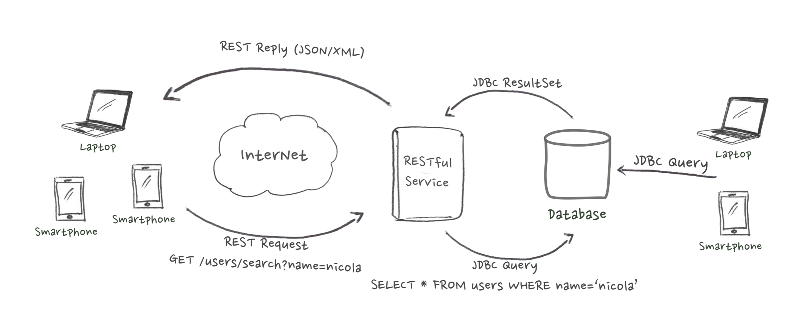
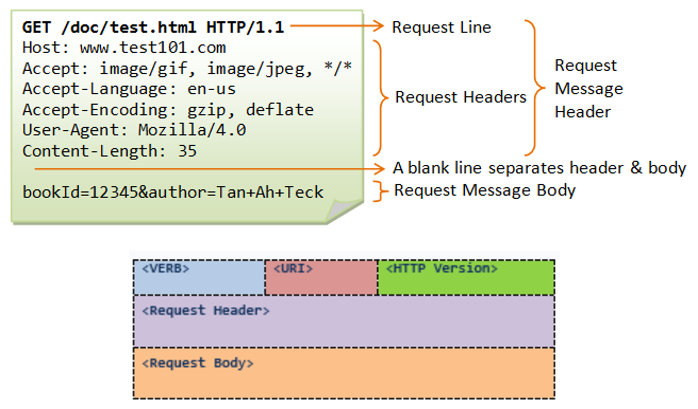
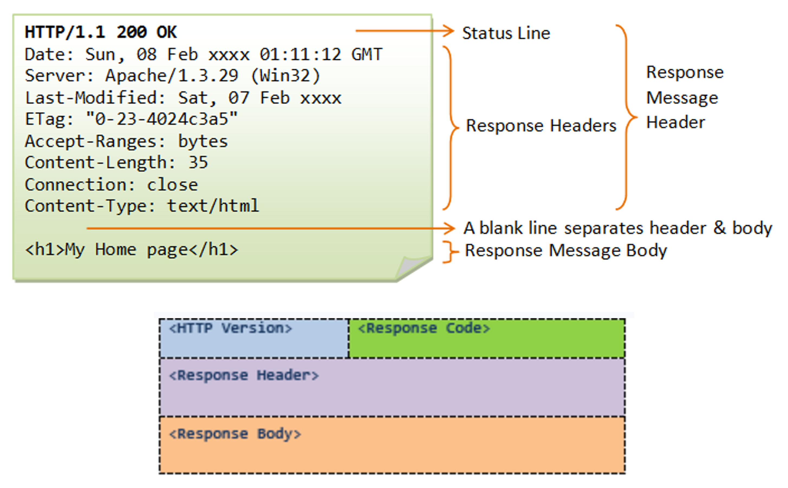

# Java Data Access (REST)

## Overview


**REST is a widely adopted architectural style that governs the design of web services, providing a scalable and interoperable framework for communication between distributed systems**. Mastery of RESTful principles allows developers to create efficient, modular, and maintainable APIs (Application Programming Interfaces), serving as a crucial foundation for building modern web applications. REST facilitates seamless integration with various platforms, enabling the creation of versatile and interconnected software systems.

```
$ curl -X GET https://dog.ceo/api/breeds/image/random | jq

{
    "message": "https://images.dog.ceo/breeds/husky/n02110185_10175.jpg",
    "status": "success"
}
```

As REST is the prevailing choice for web service design, developers who grasp its concepts can easily collaborate on industry-standard projects and contribute effectively to the development of scalable and reliable applications. 



**Advantages**

- **REST is a great way of developing lightweight Web services that are easy to implement, maintain, and discover.**
- HTTP provides an excellent interface to implement RESTful services with features like a uniform interface and caching.
- If we get the basics right, a RESTful service can be easily implemented using any of the existing technologies such as Python, .NET, or Java.

**Issues**

* **No transactions support:** DBMS (usually behind REST services) support transactions
* **No publish/subscribe support:** Notification is done by polling.
* **High bandwidth:** HTTP uses a request/response model, so there’s a lot of baggage flying around the network to make it all work.


## Key Concepts 
In the context of web services and the Representational State Transfer (REST) architectural style, several key concepts play pivotal roles:
* **Messages**, at the core, embody the data exchanged between clients and servers. These messages can encapsulate requests or responses, typically formatted in common data interchange formats like JSON or XML. 
* **Resources**, identified by Uniform Resource Identifiers (URIs), represent entities that clients interact with. These URIs act as unique identifiers for resources, allowing clients to locate and manipulate them. 
* **Representations** denote the various formats in which resources can be presented, catering to diverse client needs. 
* **Operations**, often referred to as HTTP methods, specify the actions performed on resources—common examples include GET for retrieval, POST for creation, PUT for updating, and DELETE for removal. 

Finally, the principle of **statelessness** is fundamental to REST, meaning that each request from a client to a server contains all the information needed to understand and process the request. Statelessness simplifies communication, enhances scalability, and ensures that each request is independent, contributing to the overall efficiency and simplicity of RESTful architectures.

### Messages 
Clients and REST services talk to each other via messages.
- Clients send an **HTTP request** to the server
- Services reply with an **HTTP response**.
Request and response contain both metadata and content.
Response content is usually represented in XML or JSON.

#### HTTP/1.1 Request


#### HTTP/1.1 Response


### Resources
- **Every system uses resources**. Resources can be pictures, videos, users data ecc...

- **The purpose of a service is to provide access to resources.**

- Developers want services to be **easy to implement, maintain, extend, and eventually scale up**.

Resources are identified with specific **URLs**.

- Format: <https://servicename/apiversion/resource/id|service>

For example:
- Place details <https://api.foursquare.com/v2/venues/VENUE_ID>
- Photos details <https://api.foursquare.com/v2/photos/PHOTO_ID>
- Search for a user <https://api.foursquare.com/v2/users/search>
- Recent checkins by friends <https://api.foursquare.com/v2/checkins/recent>

### Representations

A resource can be thought of as an object as in OOP or a record in a SQL Database. While designing a system, the first thing to do is identify the resources and determine how they relate. Once resources have been identified,  **it is important to properly represent them**.


**JSON**

```
{"guests":[
  { "firstName":"John", "lastName":"Doe" },
  { "firstName":"María", "lastName":"García" },
  { "firstName":"Nikki", "lastName":"Wolf" }
]}
```

**XML**

```
<guests>
  <guest>
    <firstName>John</firstName> <lastName>Doe</lastName>
  </guest>
  <guest>
    <firstName>María</firstName> <lastName>García</lastName>
  </guest>
  <guest>
    <firstName>Nikki</firstName> <lastName>Wolf</lastName>
  </guest>
</guests>
```


### Operations

- **GET**: Read a resource (Safe)
- **PUT** Insert/update a resource. (Idempotent)
- **POST** Insert/update a resource (N/A) 
- **DELETE** Delete a resource (Idempotent)

A **Safe HTTP method** does not make any changes to the resource on the server.

An **Idempotent HTTP method** has same effect no matter how many times it is performed.

Classifying methods as Safe and Idempotent makes it easy to predict the results in unreliable environments such as the Web (clients may fire the same request multiple times for example)


## Addressing resources (URIs)

- REST requires each resource to have at least one URI
- **RESTful services uses a directory hierarchy to address resources**.
- **The job of a URI is to identify a resource or a collection of resources**.
- The actual operation is determined by an HTTP verb. The URI should not say anything about the operation or action
- *Protocol://ServiceName/ResourceType/ResourceID*

- **Use plural nouns** for naming your resources.
- **Avoid using spaces** as they create confusion. Use an _ (underscore) or – (hyphen) - instead.
- A URI is **case-insensitive**. I use camel case in my URIs for better clarity. You can use all lower-case URIs.
- A **cool URI never changes**; so give some thought before deciding on the URIs for your service. If you need to change the location of a resource, do not discard the old URI and redirect the client to the new location.
- **Avoid verbs** for your resource names. Verbs are more suitable for the names of operations.

## Query parameters
The basic purpose of query parameters is to provide parameters to an operation that needs the data items.
- <http://MyService/Persons/1?format=json>
- <http://MyService/Persons/search?name=‘nicola’>

Avoid this!
- <http://MyService/Persons/1/json/>

## Statelessness

A **RESTful service is stateless** and does **not maintain the application state** for any client. A request cannot be dependent on a past request. A REST service treats each request independently.

**Stateless design**

- Request1: *GET <http://MyService/Persons/1> HTTP/1.1*
- Request2: *GET <http://MyService/Persons/2> HTTP/1.1*

**Stateful design (Dangerous! Which client??)**

- Request1: *GET <http://MyService/Persons/1> HTTP/1.1*
- Request2: *GET <http://MyService/NextPerson> HTTP/1.1*

## Documentation

**There is no excuse for not documenting your service.**

- You should document every resource and URI for client developers.

- You can use any format for structuring your document, but it should contain enough information about resources, URIs, Available Methods, and any other information required for accessing your service.


## Resources
- https://github.com/toddmotto/public-apis
